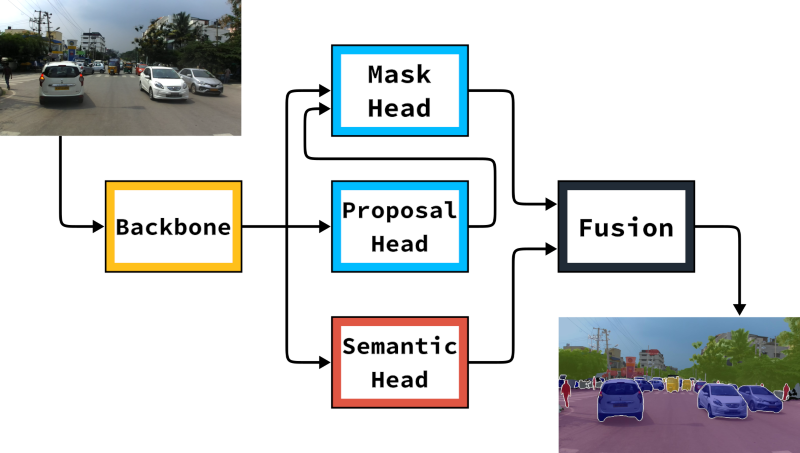

# Seamless Scene Segmentation

<p align="center">

<br>
<a href="http://openaccess.thecvf.com/content_CVPR_2019/html/Porzi_Seamless_Scene_Segmentation_CVPR_2019_paper.html">CVPR</a>
|
<a href="https://arxiv.org/abs/1905.01220">arXiv</a>
</p>

Seamless Scene Segmentation is a CNN-based architecture that can be trained end-to-end to predict a complete class- and
instance-specific labeling for each pixel in an image. To tackle this task, also known as "Panoptic Segmentation", we take
advantage of a novel segmentation head that seamlessly integrates multi-scale features generated by a Feature Pyramid
Network with contextual information conveyed by a light-weight DeepLab-like module.

This repository currently contains training and evaluation code for Seamless Scene Segmentation in PyTorch, based on our re-implementation of Mask R-CNN. 

If you use Seamless Scene Segmentation in your research, please cite:
```bibtex
@InProceedings{Porzi_2019_CVPR,
  author = {Porzi, Lorenzo and Rota Bul\`o, Samuel and Colovic, Aleksander and Kontschieder, Peter},
  title = {Seamless Scene Segmentation},
  booktitle = {The IEEE Conference on Computer Vision and Pattern Recognition (CVPR)},
  month = {June},
  year = {2019}
}
```

## Requirements and setup

Main system requirements:
* CUDA 10.1
* Linux with GCC 7 or 8
* PyTorch v1.1.0

**IMPORTANT NOTE**: These requirements are not necessarily stringent, e.g. it might be possible to compile with older
versions of CUDA, or under Windows. However, we have only tested the code under the above settings and cannot provide support for other setups.

**IMPORTANT NOTE 2**: Due to some breaking changes in the handling of boolean operations, seamseg is currently not compatible with Pytorch v1.2.0 or newer.

To install PyTorch, please refer to https://github.com/pytorch/pytorch#installation.

To install all other dependencies using pip:
```bash
pip install -r requirements.txt
```

### Setup

Our code is split into two main components: a library containing implementations for the various network modules,
algorithms and utilities, and a set of scripts to train / test the networks.

The library, called `seamseg`, can be installed with:
```bash
git clone https://github.com/mapillary/seamseg.git
cd seamseg
python setup.py install
```
or, in a single line:
```bash
pip install git+https://github.com/mapillary/seamseg.git
```

The scripts do not require installation (but they *do* require `seamseg` to be installed), and can be run
from the `scripts/` folder. *Note:* Do not run the scripts from the main folder of this repo, otherwise python might
decide to load the local copy of the `seamseg` package instead of the one installed above, causing issues.

## Trained models

The model files provided below are made available under the [CC BY-NC-SA 4.0](https://creativecommons.org/licenses/by-nc-sa/4.0/) license.

| Model | PQ | Link + md5 |
|-------|----|------------|
| SeamSeg ResNet50, Mapillary Vistas | 37.99 | [7046e54e54e9dcc38060b150e97f4a5a][1] |

[1]: https://drive.google.com/file/d/1ULhd_CZ24L8FnI9lZ2H6Xuf03n6NA_-Y/view

The files linked above are `zip` archives, each containing model weights (`.tar` file), configuration parameters (`config.ini` file) and the metadata file of the dataset the model was trained on (`metadata.bin` file).
To use a model, unzip it somewhere and follow the instructions in the [Running inference"](#running-inference) section below.

## Using the scripts

Our code uses an intermediate data format to ease training on multiple datasets, described
[here](https://github.com/mapillary/seamseg/wiki/Seamless-Scene-Segmentation-dataset-format).
We provide pre-made scripts to convert from [Cityscapes](scripts/data_preparation/prepare_cityscapes.py) and
[Mapillary Vistas](scripts/data_preparation/prepare_vistas.py) to our format.

When training, unless explicitly training from scratch, it's also necessary to convert the ImageNet pre-trained weights
provided by PyTorch to our network format.
To do this, simply run:
```bash
cd scripts/utility
python convert_pytorch_resnet.py NET_NAME OUTPUT_FILE
```
where `NET_NAME` is one of `resnet18`, `resnet34`, `resnet50`, `resnet101` or `resnet152`.

### Training

Training involves three main steps: Preparing the dataset, creating a configuration file and running the training
script.
To prepare the dataset, refer to the format description [here](https://github.com/mapillary/seamseg/wiki/Seamless-Scene-Segmentation-dataset-format), or
use one of the scripts in [scripts/data_preparation](scripts/data_preparation).
The configuration file is a simple text file in `ini` format.
The default value of each configuration parameter, as well as a short description of what it does, is available in
[seamseg/config/defaults](seamseg/config/defaults).
**Note** that these are just an indication of what a "reasonable" value for each parameter could be, and are not
meant as a way to reproduce any of the results from our paper.

To launch the training:
```bash
cd scripts
python -m torch.distributed.launch --nproc_per_node=N_GPUS train_panoptic.py --log_dir LOG_DIR CONFIG DATA_DIR 
```
Note that, for now, our code **must** be launched in "distributed" mode using PyTorch's `torch.distributed.launch`
utility.
It's also highly recommended to train on multiple GPUs (possibly 4-8) in order to obtain good results.
Training logs, both in text and Tensorboard formats, will be written in `LOG_DIR`.

The validation metrics reported in the logs include mAP, PQ and mIOU, computed as follows:
* For mAP (both mask and bounding box), we resort to the original implementation from the
[COCO API](https://github.com/cocodataset/cocoapi). This is the reason why our dataset format also includes COCO-format
annotations.
* For PQ (Panoptic Quality) and mIOU we use our own implementations. Our PQ metric has been verified to produce
results that are equivalent to the [official implementation](https://github.com/cocodataset/panopticapi), minus
numerical differences.

#### Training with the Vistas settings from our paper:
```bash
cd scripts
python -m torch.distributed.launch --nproc_per_node=8 \
    train_panoptic.py --log_dir LOG_DIR \
    configurations/vistas_r50.ini DATA_DIR
```

#### Training with the Cityscapes settings from our paper:
```bash
cd scripts
python -m torch.distributed.launch --nproc_per_node=8 \
    train_panoptic.py --log_dir LOG_DIR \
    configurations/cityscapes_r50.ini DATA_DIR
```

### Running inference

Given a trained network, inference can be run on any set of images using
[scripts/test_panoptic.py](scripts/test_panoptic.py):
```bash
cd scripts
python -m torch.distributed.launch --nproc_per_node=N_GPUS test_panoptic.py --meta METADATA --log_dir LOG_DIR CONFIG MODEL INPUT_DIR OUTPUT_DIR
```
Images (either `png` or `jpg`) will be read from `INPUT_DIR` and recursively in all subfolders, and predictions will be
written to `OUTPUT_DIR`.
The script also requires to be given the `metadata.bin` file of the dataset the network was originally trained on.
Note that the script will only read from the `"meta"` section, meaning that a stripped-down version of `metadata.bin`,
i.e. without the `"images"` section, can also be used.

By default, the test scripts output "qualitative" results, i.e. the original images superimposed with their panoptic segmentation.
This can be changed by setting the `--raw` flag: in this case, the script will output, for each image, the "raw" network
output as a PyTorch `.pth.tar` file.
An additional script to process these raw outputs into COCO-format panoptic predictions will be released soon.
